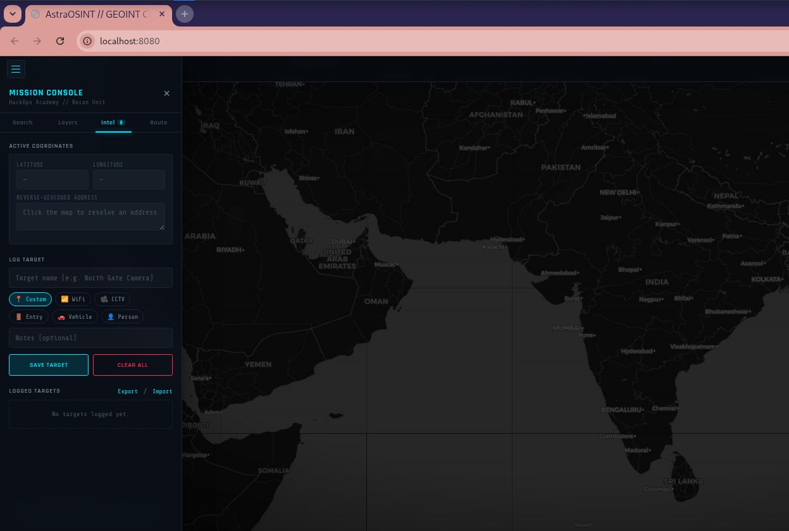
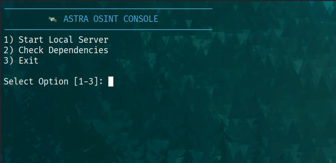

# 🛰️ AstraOSINT | Tactical GEOINT Console


**AstraOSINT** is a professional-grade, web-based Geospatial Intelligence (GEOINT) console built for OSINT researchers, pentesters, and security analysts. It provides a single tactical interface for satellite imagery analysis, target/point-of-interest tracking, and route planning — fully client-side, no backend, no accounts.

Developed by **HackOps Academy**.

---

## 📸 Preview

**Mission Console — Intel tab, tactical dark layer**


**`run.sh` launcher menu**


---

## 🚀 Key Features

### 🖥️ Tactical HUD Interface
* Live top status bar — UTC clock, cursor lat/lng, zoom level, connection status.
* Tabbed **Mission Console** (Search / Layers / Intel / Route) instead of a single scrolling menu.
* Ambient scanline, vignette, and radar-sweep overlay for a console feel — respects `prefers-reduced-motion`.
* Toast notification system for feedback (no jarring `alert()` popups).

### 🌍 Multimodal Mapping
* **Street**, **Satellite**, **Terrain**, and **Tactical (dark)** tile layers, switchable in one click.
* Optional marker clustering toggle for dense target sets.

### 📍 Intel Management
* Click anywhere on the map to designate a target — instant reverse geocoding for a real-world address.
* **Tagged targets**: WiFi, CCTV, Entry, Vehicle, Person, or Custom — each with its own icon on the map and in the list.
* Per-target notes, one-click delete, and a persistent bottom-left coordinate readout with copy-to-clipboard.
* **Export / Import** the full intel log as JSON for backup or sharing between machines.
* Locate-me (device geolocation) support.

### 🗺️ Tactical Routing
* Plot a road route between any two logged targets with live distance/time estimates.
* Automatic dashed line-of-sight fallback when road data is unavailable.

### 🔍 Advanced Search
* Global place/address search with a result list (not just "jump to first match").
* `Ctrl`/`Cmd` + `K` to jump into search from anywhere, `Esc` to close the console.

---

## 🛠️ Tech Stack

| Component | Technology |
| :--- | :--- |
| **Mapping Engine** | [Leaflet.js](https://leafletjs.com/) |
| **Clustering** | Leaflet.markercluster |
| **Routing** | Leaflet Routing Machine + OSRM |
| **Geocoding / Search** | OpenStreetMap Nominatim |
| **UI/UX** | Custom CSS3 (design tokens) + vanilla JS, Rajdhani / Share Tech Mono type |

No frameworks, no build step, no tracking — everything runs in the browser and talks only to the public OSM/OSRM APIs.

---

## ⚙️ Installation & Usage

1.  **Clone the Repository**
    ```bash
    git clone https://github.com/hackops-academy/AstraOSINT.git
    cd AstraOSINT
    ```
2.  **Make the launcher executable**
    ```bash
    chmod +x run.sh
    ```
3.  **Launch**
    ```bash
    ./run.sh
    ```
    Choose option `1) Start Local Server`. It starts a Python HTTP server on port 8080 and auto-opens `http://localhost:8080` in your default browser.

### Basic workflow
- Click the map to designate a target → the **Intel** tab fills in coordinates and address automatically.
- Name it, pick a tag, hit **Save Target** → it's logged to the map and the sidebar list.
- Use **Route** to plot a path between two logged targets, or **Export** to save your intel log as JSON.

---

## 📂 Project Structure

```text
├── index.html          # Main application entry point
├── run.sh               # Local server launcher / dependency check
├── css/
│   └── style.css        # Design tokens + tactical HUD styling
├── js/
│   ├── map.js            # Leaflet engine, intel storage, routing
│   └── ui.js              # Console tabs, HUD, toasts, interactions
└── screenshots/          # README preview images
```

## 🤝 Contributing
Contributions are welcome! If you have ideas for new layers (Thermal, Weather, etc.), new target tag types, or better data export formats:
1. Fork the project
2. Create your feature branch (`git checkout -b feature/AmazingFeature`)
3. Commit your changes (`git commit -m 'Add some AmazingFeature'`)
4. Push to the branch (`git push origin feature/AmazingFeature`)
5. Open a Pull Request

## ⚖️ Disclaimer
This tool is intended for Open Source Intelligence (OSINT) research and educational purposes. Always respect privacy laws and the Terms of Service of the map data providers.

Developed with ❤️ by HackOps Academy.
